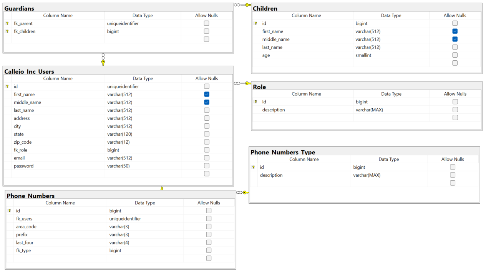

<h1 align="center">Callejo Inc. Childcare Website</h1>

  

## Project Synopsis
The Callejo Inc. Childcare Website is a completed senior project developed by Tech Squad, a team of Computer Science students at California State University, Sacramento. Spanning from Fall 2024 to Spring 2025, this project was created to support the daily operations of Jane Callejo’s family-owned childcare business.

Prior to this system, key processes such as managing child rosters, and tracking business expenses were done manually, leading to inefficiencies and the potential for errors. Our team developed a centralized, user-friendly web application to streamline these operations, reduce administrative workload, and improve record accuracy.

Additionally, the platform enhances communication with parents by providing timely updates and notifications. By delivering a secure, responsive, and role-based interface for both parents and administrators, our system improves operational transparency and helps staff stay focused on providing quality childcare.

## Key Features
- **Feature 1**: User Experience
  - The website provides an easy to follow and visually appealing UI
  - Users can login to created accounts and stay up to date with their child's schedule/planner and track upcoming events
- **Feature 2**: Admin Controls
  - Admin users will have better business management tools via the web app
  - Admins can: observe and track business expenses, set and manage employee tasks, and manage customer accounts.
- **Feature 3**: Password Reset
  - Users are able to recover their password via the "Forgot Password" functionality.

## Project Status
The software engineering team developed a comprehensive web application involving three main components: the frontend, backend, and database. For the frontend, we used Blazor, a framework for building interactive web UI with C# in conjuction with JavaScript, to create a dynamic and responsive user interface. Our team also employed HTML, CSS, to design the structure, style, and interactivity of the application, ensuring an intuitive user experience. Blazor enabled us to write both client-side and server-side code in C#, providing a seamless and consistent approach to frontend development. The backend was implemented using C#, handling the logic and operations that support the frontend. It served as the bridge between the frontend and the database, ensuring data is processed and sent to the user interface. For the database layer, MS SQL (Microsoft SQL Server) was used, where data is stored, managed, and retrieved. The team set up tables, relationships, and queries to handle data persistence efficiently. The entire application, including the frontend, backend, and database, will  be deployed on Azure, which provides a cloud infrastructure to host the application, manage scalability, and ensure reliability.

## Images and Diagrams
### Mock Up (created in Jira)

  

### ERD (Entity-Relationship Diagram)

  

### Images of Website
Welcome Page: 

  

Personalized Customer Page: 

  

Admin Portal Page: 

  

## Testing
To ensure reliability and maintainability, our team implemented unit tests for the main API controllers using the xUnit testing framework and Moq for mocking dependencies. Located in the CallejoIncChildcareAPI.Tests/Controllers directory, there are several tests that the team created. To run these tests, simply right click one of the tests and click "Run Test".

  

## Deployment
*Placeholder for deployment steps and considerations to be completed in CSC 191.*

## Developer Instructions
*Placeholder for developer setup instructions including dependencies, installation, and configuration steps to be completed in CSC 191.*

## Contributors
**Team Tech Squad**
- Evan Callejo (Team Lead)
- Masoud Ahang
- Angel Calderon
- Wei Chong
- Jonathon Delemos
- Justin Ear
- Chris Iverson
- Alan Lei

*All team members contributed to both front-end and back-end development for this project.*

## Contact Information
- Masoud Ahang (Development Team):
    - masoudahang@csus.edu
- Angel Calderon (Development Team):
    - angelcalderon2@csus.edu
- Evan Callejo (Development Team):
    - evancallejo@csus.edu
- Wei Chong (Development Team):
    - weichong@csus.edu
- Jonathon Delemos (Development Team):
    - jdelemos@csus.edu
- Justin Ear (Development Team):
    - justinear@csus.edu
- Chris Iverson (Development Team):
    - civerson@csus.edu
- Alan Lei (Development Team):
    - alei2@csus.edu
- Samuel and Jane Callejo (Clients):
    - samuelcallejo7406@gmail.com
    - samuelcallejo@callejoinc527.onmicrosoft.com
